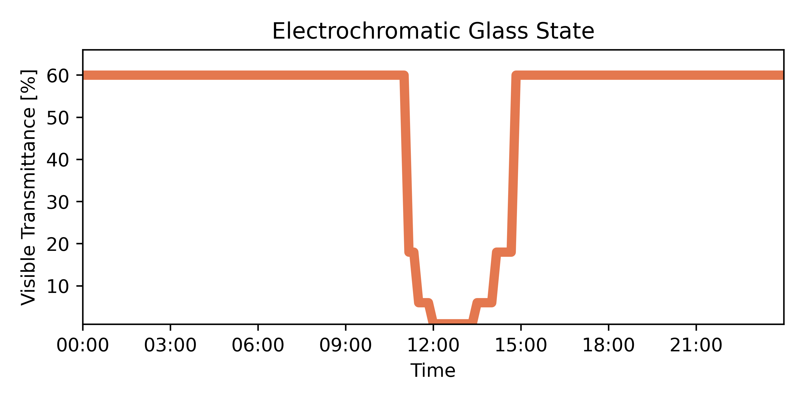
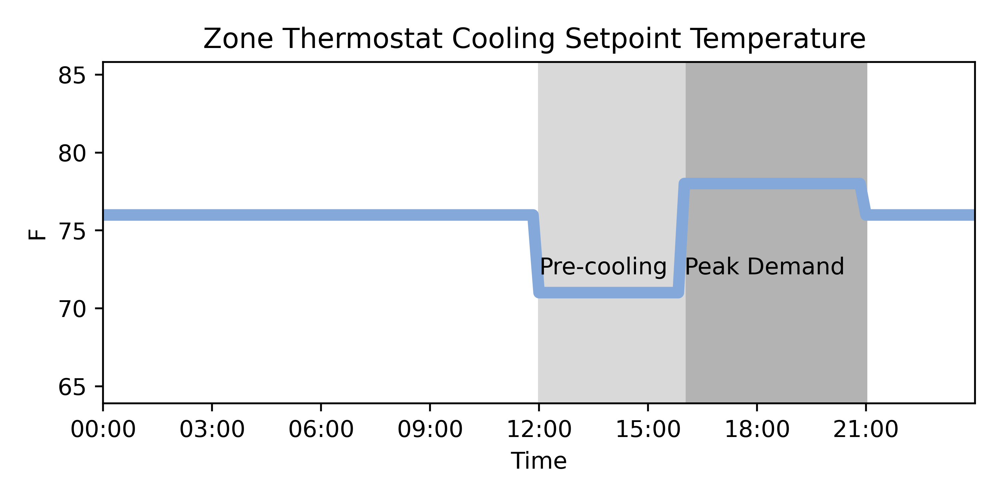
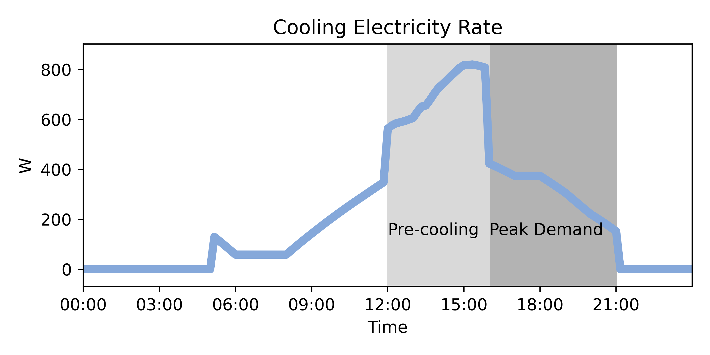
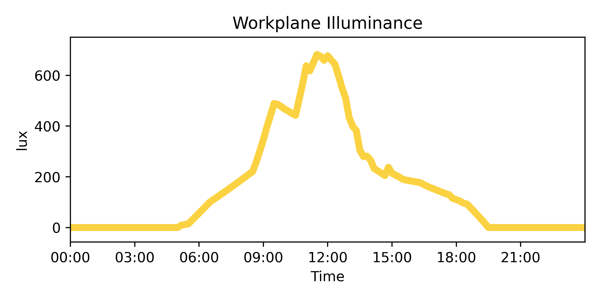
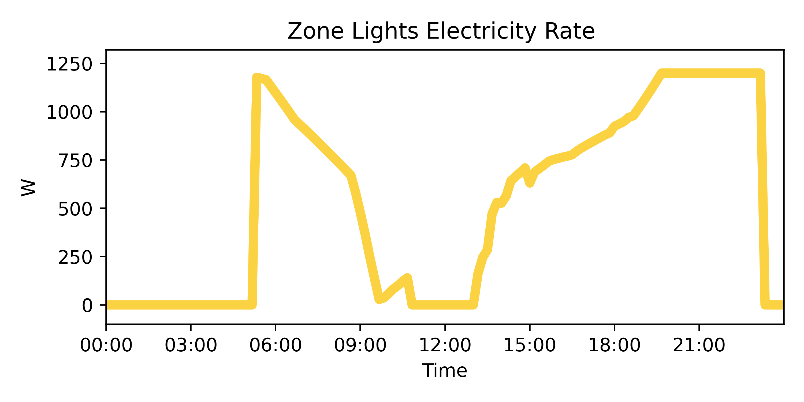

# How to model dynamic shading control and daylight dimming with EnergyPlus?


The example demonstrates how to use a controller function to control the shading state, cooling setpoint temperature, and electric lighting power intensity during simulation. At the beginning of each timestep, EnergyPlus will call the controller function that operates the facade shading state based on exterior solar irradiance, cooling setpoint temperature based on time of day (pre-cooling), and electric lighting power intensity based on occupancy and workplane illuminance (daylight dimming). The workplane illuminance is calculated using the three-phase method through Radiance. 

**Workflow**

1. [Setup an EnergyPlus Model](#1-setup-an-energyplus-model)

2. [Build a Radiance Model from the EnergyPlus Model](#2-build-a-radiance-model-from-the-energyplus-model)

3. [Define controller function](#3-define-controller-function)

4. [Run simulation](#4-run-simulation)


```mermaid
graph LR

    subgraph <b>IGSDB</b>
    A[Step 1.2 glazing products]
    B[Step 1.2 shading products]
    end

    subgraph <b>frads</b>

    C[Step 1.1 idf/epjs] --> |Initialize an EnergyPlus model| E;

    subgraph Step 4 simulation
    subgraph <b>2. Radiance</b>
    R[Workplane Illuminance]
    end
    subgraph <b>1. EnergyPlus</b>
    E[EnergyPlusModel]<--> K[Step 3 controller function<br/> <br/> * switch shading state <br/> * daylight dimming <br/>* pre-cooling <br/>] 
    E <--> R
    K <--> R;
    end
    end

    subgraph  <b>WincalcEngine</b>
    A --> D[Step 1.3 glazing/shading system<br/>for each CFS state];
    B --> D;
    D --> |Add glazing systems| E;
    end

    L[Step 1.4 lighting systems] --> |Add lighting| E;

    end
```

**Input**

A working EnergyPlus model in an idf or epjson file format. The model should have at least one exterior window.

## 0. Import required Python libraries

```python
import frads as fr
```


## 1. Setup an EnergyPlus Model
### 1.1 Initialize an EnergyPlus model
The [example idf](https://github.com/LBNL-ETA/frads/blob/main/test/Resources/RefBldgMediumOfficeNew2004_southzone.idf) is based on the DOE commercial reference medium office. This file has two zones: 

* One perimeter zone with a south-facing window
* One plenum zone


Initialize an EnergyPlus model by calling `EnergyPlusModel` class with an input of idf or epjson file. 


```python
epmodel = fr.EnergyPlusModel("RefBldgMediumOfficeNew2004_southzone.idf")
```

### 1.2 Create glazing systems (Complex Fenestration States)

!!! example "Create four glazing systems for the four electrochromatic tinted states"
    Each glazing system consists of:
    
    * One layer of electrochromic glass
    * One gap (10% air and 90% argon) at 0.0127 m thickness
    * One layer of clear glass

Initialize a glazing system by calling `GlazingSystem()`.

```python
gs_ec01 = fr.GlazingSystem()
```

Then, use `add_glazing_layer` and `add_shading_layer` to add glazing and shading layers to the glazing system. The layers should added from the outside to the inside.  `add_glazing_layer ` takes in a `.dat` or `.json` file. `add_shading_layer` takes in a `.xml` file. Visit the [IGSDB](https://igsdb.lbl.gov/) website to download  `.json` files for glazing products and `.xml` files for shading products. 

```python
# SageGlass SR2.0_7mm lami fully tinted 1%T
gs_ec01.add_glazing_layer(
    "igsdb_product_7405.json"
)  
# 3mm clear glass
gs_ec01.add_glazing_layer(
    "CLEAR_3.DAT"
) 
```

The default gap between the layers is air at 0.0127 m thickness. To customize the gap, use the `gaps` attribute of the `GlazingSystem`class. The `gaps` attribute is a list of tuples, where each tuple defines a gap. Each gap tuple consists of tuples defining the gas composition and a float defining the gap thickness. The gas composition tuple consists of the gas type and the gas fraction. The gas type can be either `fr.AIR` or `fr.ARGON` or `fr.Xenon` or `fr.KRYPTON`. The gas fraction is a float between 0 and 1. 

```python
gs_ec01.gaps = [
    ((fr.AIR, 0.1), (fr.ARGON, 0.9), 0.0127)
]
```

!!! tip "Tips: customize glazing system name"

    ```
    >>> gs_ec01_d.name # get glazing system name
     'igsdb_product_7405_Generic Clear Glass'

    >>> gs_ec01.name = "ec01" # customize glazing system name
    ```

??? info "Create glazing systems for the other tinted electrochromatic states"
    ```python
    gs_ec06 = fr.GlazingSystem()
    gs_ec06.add_glazing_layer(
        "products/igsdb_product_7407.json"
    )  # SageGlass® SR2.0_7mm lami int state 6%T
    gs_ec06.add_glazing_layer("products/CLEAR_3.DAT")
    gs_ec06.gaps = [((fr.AIR, 0.1), (fr.ARGON, 0.9), 0.0127)]
    gs_ec06.name = "ec06"

    gs_ec18 = fr.GlazingSystem()
    gs_ec18.add_glazing_layer(
        "products/igsdb_product_7404.json"
    )  # SageGlass® SR2.0_7mm lami int state 18%T
    gs_ec18.add_glazing_layer("products/CLEAR_3.DAT")
    gs_ec18.gaps = [((fr.AIR, 0.1), (fr.ARGON, 0.9), 0.0127)]
    gs_ec18.name = "ec18"

    gs_ec60 = fr.GlazingSystem()
    gs_ec60.add_glazing_layer(
        "products/igsdb_product_7406.json"
    )  # SageGlass® SR2.0_7mm lami full clear 60%T
    gs_ec60.add_glazing_layer("products/CLEAR_3.DAT")
    gs_ec60.gaps = [((fr.AIR, 0.1), (fr.ARGON, 0.9), 0.0127)]
    gs_ec60.name = "ec60"
    ```

### 1.3 Add glazing systems to EnergyPlus model

Call `add_glazing_system` from the `EnergyPlusModel` class to add glazing systems to the EnergyPlus model. `add_glazing_system` takes in a `GlazingSystem` object.


```python
epmodel.add_glazing_system(gs_ec01)
```
??? info "Add other glazing systems to the EnergyPlus model"
    ```python
    epmodel.add_glazing_system(gs_ec06)
    epmodel.add_glazing_system(gs_ec18)
    epmodel.add_glazing_system(gs_ec60)
    ```

### 1.4 Add lighting systems to EnergyPlus model
Call `add_lighting` from the `EnergyPlusModel` class to add lighting systems to the EnergyPlus model. `add_lighting` takes in the name of the zone to add lighting to and an optional `replace` argument. If `replace` is `True`, the zone's existing lighting system will be replaced by the new lighting system. If `replace` is `False` and the zone already has a lighting system, an error will be raised. The default value of `replace` is `False`.

```python
epmodel.add_lighting("Perimeter_bot_ZN_1", replace=True)
```

??? tip "Tips: available attributes for EnergyPlusModel."

    ```
    >>> epmodel.zones
    ['FirstFloor_Plenum', 'Perimeter_bot_ZN_1']
    ```

    ```
    >>> epmodel.walls_window # wall with window
    ['Perimeter_bot_ZN_1_Wall_South']
    ```

    ```
    >>> epmodel.windows
    ['Perimeter_bot_ZN_1_Wall_South_Window']
    ```

    ```
    >>> epmodel.complex_fenestration_states
    ['ec01', 'ec06', 'ec18', 'ec60']
    ```

    ```
    >>> epmodel.lights
    ['Light_Perimeter_bot_ZN_1']
    ```

    ```
    >>> epmodel.floors
    ['FirstFloor_Plenum_Floor_1', 'Perimeter_bot_ZN_1_Floor']
    ```

## 2. Build a Radiance Model from the EnergyPlus Model

### 2.1 Create a Radiance model from an EnergyPlus model

Create a Radiance model by calling `epjson_to_rad`and passing in an EnergyPlus model and an optional weather file.

```python
radmodel = fr.epjson_to_rad(epmodel, epw="USA_CA_Oakland.Intl.AP.724930_TMY3.epw")
```

### 2.2 Use the Radiance model to perform the three-phase method 

The three-phase method is used for calculating workplane illuminance. The workplane illuminance is used to control the electric lighting power (more explanation in [3. Define controller function](#3-define-controller-function)).

Use `WorkflowConfig` to generate a workflow configuration for each zone, in which to compute the three-phase method. The `WorkflowConfig.from_dict` method takes in a dictionary representing a zone. The dictionary can be accessed by calling `radmodel["ZoneName"]`.

```python
rad_cfg = fr.WorkflowConfig.from_dict(radmodel["Perimeter_bot_ZN_1"])
```


Use `ThreePhaseMethod`to perform the three-phase method. The `ThreePhaseMethod` class takes in a `WorkflowConfig` object.

```python
rad_workflow = fr.ThreePhaseMethod(rad_cfg)
```

Use `generate_matrices` to generate the view, daylight, and transmission matrices.

```python
rad_workflow.generate_matrices()
```

## 3. Define controller function 

**Actuate**

Use `EnergyPlusSetup.actuate` to set or update the operating value of an actuator in the EnergyPlus model. `EnergyPlusSetup.actuate` takes in a component type, name, key, and value. The component type is the actuator category, e.g. "Weather Data". The name is the name of the actuator, e.g. "Outdoor Dew Point". The key is the instance of the variable to retrieve, e.g. "Environment". The value is the value to set the actuator to.

**Variable**

You can access EnergyPlus variable during simulation using `EnergyPlusSetup.get_variable_value` and passing in a variable name and key. To access an Energyplus variable during simulation, you need to first request the variable before running the simulation by calling `EnergyPlusSetup.request_variable` (more explanation in [4. Run simulation](#4-run-simulation)).

!!! tip "Tips"
    You can use `EnergyPlusSetup.get_variable_value` to access the EnergyPlus variable during the simulation and use the variable to control the actuator. For example, you can use `get_variable_value` to access the exterior solar irradiance and use the irradiance value to control the facade shading state.


!!! example "Control algorithms"
    * **Shading** Control facade shading state based on exterior solar irradiance
    * **Cooling setpoint** Control cooling setpoint temperature based on time of day (pre-cooling)
    * **Lighting power intensity** Control electric lighting power intensity based on occupancy and workplane illuminance (daylight dimming)

 The transmission matrices, generated from the three-phase method, will be used to calculate the workplane illuminance during simulation. Use `load_matrices` to load transmission matrices created by `epjson_to_rad` and store them in a dictionary.

```python
tmx_dict = {
    "ec01": fr.load_matrix("Resources/ec01.xml"),
    "ec06": fr.load_matrix("Resources/ec06.xml"),
    "ec18": fr.load_matrix("Resources/ec18.xml"),
    "ec60": fr.load_matrix("Resources/ec60.xml"),
}
```

**Controller function**

The controller function will be called by EnergyPlus during the simulation. The controller function takes in a `state` argument. The controller function will be called at the beginning of each system timestep (more explanation in [4.2 Initialize EnergyPlusSetup and run simulation](#42-initialize-energyplussetup-and-run-simulation)). The controller function will control the facade shading state, cooling setpoint temperature, and electric lighting power intensity.

```py linenums="1" hl_lines="2 6 30 49"

def controller(state):
    # check if the api is fully ready
    if not epmodel.api.exchange.api_data_fully_ready(state):
        return

    # control facade shading state based on exterior solar irradiance
    # get exterior solar irradiance
    ext_irradiance = ep.get_variable_value(
        name="Surface Outside Face Incident Solar Radiation Rate per Area",
        key="Perimeter_bot_ZN_1_Wall_South_Window",
    )
    # facade shading state control algorithm
    if ext_irradiance <= 300:
        ec = "60"
    elif ext_irradiance <= 400 and ext_irradiance > 300:
        ec = "18"
    elif ext_irradiance <= 450 and ext_irradiance > 400:
        ec = "06"
    elif ext_irradiance > 450:
        ec = "01"
    shade = f"ec{ec}"
    # actuate facade shading state
    ep.actuate(
        component_type="Surface",
        name="Construction State",
        key="Perimeter_bot_ZN_1_Wall_South_Window",
        value=ep.construction_handles[shade],
    )

    # control cooling setpoint temperature based on the time of day
    # pre-cooling
    # get the current time
    datetime = ep.get_datetime()
    # control cooling setpoint temperature control algorithm
    if datetime.hour >= 16 and datetime.hour < 21:
        clg_setpoint = 25.56
    elif datetime.hour >= 12 and datetime.hour < 16:
        clg_setpoint = 21.67
    else:
        clg_setpoint = 24.44
    # actuate cooling setpoint temperature
    ep.actuate(
        component_type="Zone Temperature Control",
        name="Cooling Setpoint",
        key="PERIMETER_BOT_ZN_1",
        value=clg_setpoint,
    )

    # control electric lighting power based on occupancy and workplane illuminance
    # daylight dimming
    # get occupant count and direct and diffuse solar irradiance
    occupant_count = ep.get_variable_value(
        name="Zone People Occupant Count", 
        key="PERIMETER_BOT_ZN_1"
    )
    direct_normal_irradiance = ep.get_variable_value(
        name="Site Direct Solar Radiation Rate per Area", key="Environment"
    )
    diffuse_horizontal_irradiance = ep.get_variable_value(
        name="Site Diffuse Solar Radiation Rate per Area", key="Environment"
    )
    # calculate average workplane illuminance
    avg_wpi = rad_workflow.calculate_sensor(
        "Perimeter_bot_ZN_1_Perimeter_bot_ZN_1_Floor",
        tmx_dict[shade],
        datetime,
        direct_normal_irradiance,
        diffuse_horizontal_irradiance,
    ).mean()
    # electric lighting power control algorithm
    if occupant_count > 0:
        lighting_power = (
            1 - min(avg_wpi / 500, 1)
        ) * 1200  # 1200W is the nominal lighting power density
    else:
        lighting_power = 0
    # actuate electric lighting power
    ep.actuate(
        component_type="Lights",
        name="Electricity Rate",
        key="Light_Perimeter_bot_ZN_1",
        value=lighting_power,
    )
```


!!! note "Notes: Workplane illuminance calculation"
    rad_workflow.calculate_sensor() takes in the following arguments:

    * `sensor`: the name of the sensor
    * `bsdf`: the transmission matrix of the CFS state
    * `time`: the datetime of the simulation
    * `dni`: the direct normal irradiance
    * `dhi`: the diffuse horizontal irradiance


## 4. Run simulation

### 4.1 Add output variable

Before the simulation run, use `add_output`to request output variables and meters that are not in the input idf file. `add_output` takes the name of the output variable or meter and the output type ("variable" or "meter"). It also takes in an optional argument `reporting_frequency` to specify the reporting frequency of the output variable or meter. The default value is "Hourly".

```python
epmodel.add_output(
    output_name="Zone Lights Electricity Rate",
    output_type="variable",
    reporting_frequency="timestep",
)
epmodel.add_output(
    output_name="Electricity:Facility", 
    output_type="meter"
)
```

### 4.2 Initialize EnergyPlusSetup and run simulation

**Initialize EnergyPlusSetup**

Initialize EnergyPlusSetup by calling `EnergyPlusSetup` and passing in an EnergyPlus model and an optional weather file.

**Request variable**

To access a variable during the simulation, you need to first request the variable before running the simulation by calling `request_variable`and passing in a variable name and key. 

**Set callback**

Register the controller functions to be called back by EnergyPlus during runtime by calling `set_callback`and passing in a callback point and function. Refer to [Application Guide for EMS](https://energyplus.net/assets/nrel_custom/pdfs/pdfs_v22.1.0/EMSApplicationGuide.pdf) for descriptions of the calling points.

This example uses `callback_begin_system_timestep_before_predictor`.

!!! quote "BeginTimestepBeforePredictor"
    The calling point called “BeginTimestepBeforePredictor” occurs near the beginning of each timestep but before the predictor executes. “Predictor” refers to the step in EnergyPlus modeling when the zone loads are calculated. This calling point is useful for controlling components that affect the thermal loads the HVAC systems will then attempt to meet. Programs called from this point might actuate internal gains based on current weather or on the results from the previous timestep. Demand management routines might use this calling point to reduce lighting or process loads, change thermostat settings, etc.

**Run simulation**

To simulate, use `run` with optional parameters:

* output_directory: Output directory path. (default: current directory)
* output_prefix: Prefix for output files. (default: eplus)
* output_suffix: Suffix style for output files. (default: L)
    * L: Legacy (e.g., eplustbl.csv)
    * C: Capital (e.g., eplusTable.csv)
    * D: Dash (e.g., eplus-table.csv)
* silent: If True, do not print EnergyPlus output to console. (default: False)
* annual: If True, force run annual simulation. (default: False)
* design_day: If True, force run design-day-only simulation. (default: False)


```py linenums="1" hl_lines="5 23 26"

with fr.EnergyPlusSetup(
    epmodel, 
    weather_file="USA_CA_Oakland.Intl.AP.724930_TMY3.epw"
) as ep:
    # request variables to be accessible during simulation
    ep.request_variable(
        name="Site Direct Solar Radiation Rate per Area", 
        key="Environment"
    )
    ep.request_variable(
        name="Site Diffuse Solar Radiation Rate per Area",
        key="Environment"
    )
    ep.request_variable(
        name="Zone People Occupant Count",
        key="PERIMETER_BOT_ZN_1"
    )
    ep.request_variable(
        name="Surface Outside Face Incident Solar Radiation Rate per Area",
        key="Perimeter_bot_ZN_1_Wall_South_Window",
    )

    # set controller function to be called at the beginning of each system timestep
    ep.set_callback("callback_begin_system_timestep_before_predictor", controller)

    # run simulation
    ep.run()
```

## 5. Visualize results

EnergyPlus run will generate a `eplusout.csv` file in the output directory. The `eplusout.csv` file contains the output variables and meters requested by `add_output`. 

The plots below show the results of the simulation. The plots are generated using the `eplusout.csv` file and the `pandas` and `matplotlib` libraries.

### 5.1 Electrochromatic glass state



### 5.2 Zone Thermostat Cooling Setpoint Temperature



### 5.3 Cooling electricity rate



### 5.4 Workplane illuminance



### 5.5 Zone lights electricity rate

