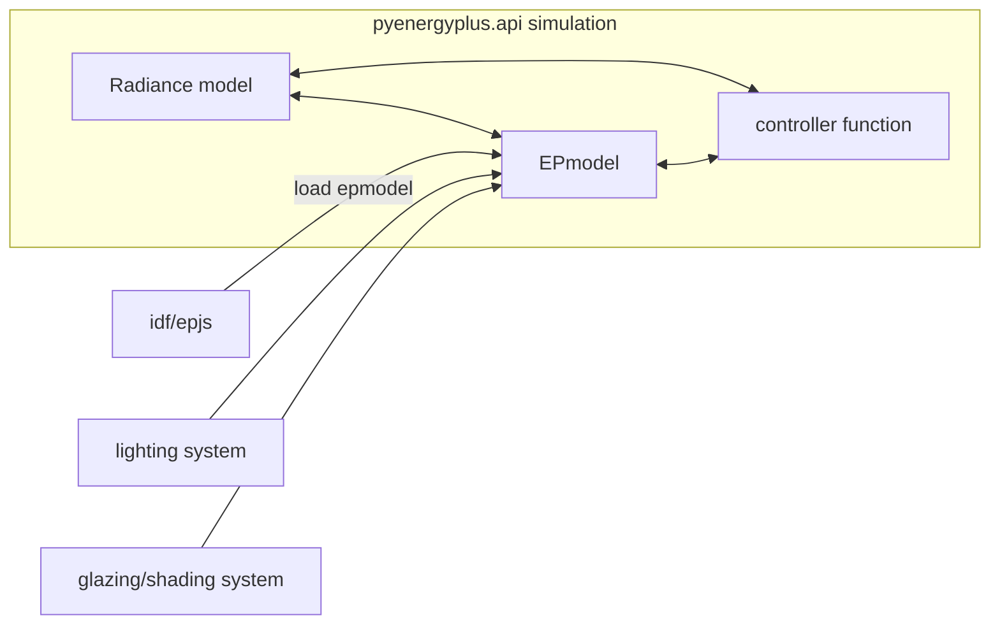
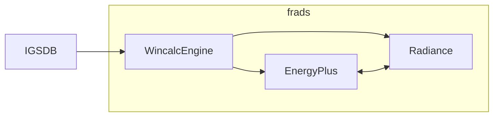

# How to model dynamic shading control and daylight dimming with EnergyPlus?

## Objective

This notebook shows how to use EnergyPlusAPI to control the complex fenestration system (CFS) state and implement daylight dimming.

## Prerequisites

In order to run this notebook, you will need to install the following:

* [energyplus](https://energyplus.net/) to simulate building energy.
* [frads](https://github.com/LBNL-ETA/frads) to initialize EnergyPlus model, and to create cfs and daylighting dimming controls.

Optional:

* [pandas](https://pandas.pydata.org/docs/getting_started/install.html) and [matplotlib](https://matplotlib.org/stable/users/installing/index.html) to analyze and plot data.


You will also need an EnergyPlus model in an idf or epjson file format. The model should contain the following:

* at least one zone
* at least one fenestration system


## Workflow
1. Initialize an E+ model with an input of idf or epjs file.
2. Create Complex Fenestration System (CFS) glazing system for each fenestration construction state and add to E+ model
3. Create lighting objects and add to E+ model
4. Define controller function for CFS construction states and daylight dimming
5. Initialize pyenergyplus.api to simulate





## Import required Python libraries

```python
import datetime
import json
import os
from pathlib import Path
import sys 

from frads import epjson2rad, eprad, parsers, matrix, methods, sky, types, window
import pandas as pd
```

Need to make sure EnergyPlus is in sys.path in order to load `pyenergyplus.api `

```python
srcloc = {'win32': 'C:\\', 'darwin': '/Applications', 'linux': '/usr/local'}
dname  = [os.path.join(srcloc[sys.platform], d) for d in os.listdir(srcloc[sys.platform]) if d.startswith('EnergyPlus')]
ephome = dname.pop()
if ephome not in sys.path:
    sys.path.append(ephome)

from pyenergyplus.api import EnergyPlusAPI
```

##  Load EnergyPlus(E+) model
The example idf file is from the EnergyPlus ExampleFiles directory. The building is 15.24m X 15.24m, single zone with one south-facing window.

Initialize an E+ model by calling `eprad.load_epmodel`with an input of idf or epjs file. The example used here can be downloaded from [here](https://github.com/NREL/EnergyPlus/blob/develop/testfiles/1ZoneUncontrolled_win_1.idf).

```python
idf_path = Path("1ZoneUncontrolled_win_1.idf")
api = EnergyPlusAPI()
epmodel = eprad.load_epmodel(idf_path, api)
```
## Example 1 - shading control and daylight dimming

### Add CFS objects to E+ model
Initialize a glazing system by calling `window.GlazingSystem()`. Then, use `add_glazing_layer` and `add_shading_layer`respectively, to add glazing and shading layer to the glazing system. `add_glazing_layer ` takes in a `.dat` or `.json` file. `add_shading_layer` takes in a `.xml` file. Visit the [IGSDB](https://igsdb.lbl.gov/) website to download  `.json` files for glazing and `.xml` files for shading. If not specify, the default gap between the layers is air at 0.0127m thickness. See [Example 2](#example-2-electrochromic-glass-with-4-tinted-states) for how to customize a gap.

Create an unshaded glazing system, consisted of one layer of 6mm clear glass with the default gap. 


```python
gs_unshaded = window.GlazingSystem()
gs_unshaded.add_glazing_layer("products/CLEAR_6.DAT")
```

This is how you get the name of the glazing system.


```python
gs_unshaded.name
```


    'Generic Clear Glass'


Create a shaded glazing system, consisted of one layer of 6mm clear glass and one layer of shading: 2011-SA1.


```python
gs_shaded = window.GlazingSystem()
gs_shaded.add_glazing_layer("products/CLEAR_6.DAT")
gs_shaded.add_shading_layer("products/2011-SA1.XML")
```


```python
gs_shaded.name
```


    'Generic Clear Glass_Satine 5500 5%, White Pearl'


After the adding glazing and shading layers to the glazing system, compute solar and the solar and photopic results using `compute_solar_photopic_results`. Need to re-compute each time when the glazing system layering composition changes.


```python
gs_unshaded.compute_solar_photopic_results()
```


```python
gs_shaded.compute_solar_photopic_results()
```

Add the unshaded and shaded glazing systems to E+ model by calling `add_cfs`.


```python
epmodel.add_cfs(gs_unshaded)
epmodel.add_cfs(gs_shaded)
```

### Add lighting objects to E+ model
Use `add_lighting`to add a lighting object for each of the zones in the building.

```python
epmodel.add_lighting()
```

This is a list of attributes of the EPModel class


```python
epmodel.windows
```


    ['Zn001:Wall001:Win001']


```python
epmodel.cfs
```


    ['Generic Clear Glass', 'Generic Clear Glass_Satine 5500 5%, White Pearl']


```python
epmodel.lighting_zone
```


    ['Light_ZONE ONE']


```python
epmodel.zones
```


    ['ZONE ONE']

### Request output  variable
Use `request_output`to request output variable that are not in the input  idf file before the simulation run.
```python
epmodel.request_output("Surface Inside Face Solar Radiation Heat Gain Rate per Area")

```

### Initialize Radiance model
Create a Radiance model by calling `epjson2rad.epjson2rad`and passing in an epjs and epw files. The epjs file can be accessed by calling `epmodel.epjs`. The `epjson2rad.epjson2rad`function creates an `Objects`directory for material and geometry primitives and a `Resources`directory for transmission matrices (xml files). The `epjson2rad.epjson2rad`function also generates a `config`file, which contains information about simulation controls setting, site, model, and raysender. Use `methods.three_phase`to perform the three-phase method and generate the view and daylight matrices under the `Matrices`directory. Finally, load the view, daylight, and transmission matrices with `load_matrix`.


```python
zone = epmodel.zones[0]
floor = epmodel.floors[0]
wall_wndo = epmodel.walls_window[0]

# generate Radiance model
# generate view, daylight, and transmission matrices
epjson2rad.epjson2rad(epmodel.epjs, epw="USA_CA_Oakland.Intl.AP.724930_TMY3.epw")
cfg_file = Path(f"{zone}.cfg")
config = parsers.parse_mrad_config(cfg_file)
config["SimControl"]["no_multiply"] = "true"
with methods.assemble_model(config) as model:
    mpath = methods.three_phase(model, config)

# load matrices
vmx_window1 = matrix.load_matrix(mpath.pvmx[f"{floor}{wall_wndo}_window"])
dmx_window1 = matrix.load_matrix(mpath.dmx[f"{wall_wndo}_window"])
tmx_unshaded = matrix.load_matrix(f"Resources/Generic Clear Glass.xml")
tmx_shaded = matrix.load_matrix(f"Resources/Generic Clear Glass_Satine 5500 5%, White Pearl.xml")
```

### Define controller function for shading control and daylight dimming
Control fenestration construction based on time; the window is shaded from 11:00 to 15:00; otherwise, unshaded. The nominal lighting power of the light is 30W, controlled with linear daylight dimming based on the workplane illuminance. The workplane illuminance at each timestep is computed by calling `matrix.multiply_rgb`and passing in the view, trasmission, daylight, and sky matrices. Sky matrix is generated by calling `sky.genskymtx`and passing in a `WeaData`and `WeaMetaData`objects.

Data is accessed through handles, which can be accessed by calling the `handles`attribute of the `EnergyPlusSetup`class.  Call `get_variable_value`and pass in a variable handle to get a variable value (e.g. Direct normal irradiance and diffuse horizontal irradiance). Call `actuate`and pass in an actuactor handle and value to set the actuator value.

```python
def controller(state):
    nominal_lighting_power = 30

    shade_names = {
        0: "Generic Clear Glass",
        1: "Generic Clear Glass_Satine 5500 5%, White Pearl",
    }

    dt = ep.get_datetime()
    direct_normal_irradiance = ep.get_variable_value(
        ep.handles.direct_normal_irradiance
    )
    diffuse_horizontal_irradiance = ep.get_variable_value(
        ep.handles.diffuse_horizontal_irradiance
    )
   
    ## control CFS construction
    window_handle = ep.handles.window_actuators["Zn001:Wall001:Win001"]

    # change the fenestration to shaded
    if dt.hour > 10 and dt.hour < 15:
        _shades = 1
        tmx = tmx_shaded
    else:
        _shades = 0
        tmx = tmx_unshaded

    ep.actuate(
        window_handle, ep.handles.complex_fenestration_state[shade_names[_shades]]
    )

    ## control lights
    light_handle = ep.handles.light_actuators["Light_ZONE ONE"]

    # create WeaData object to create smx
    weadata = types.WeaData(
        time=dt, dni=direct_normal_irradiance, dhi=diffuse_horizontal_irradiance
    )
    # initialize sky/sun matrix
    smx = matrix.load_matrix(sky.genskymtx([weadata], meta, mfactor=4))
    # get workplane illuminance
    wpi = matrix.multiply_rgb(vmx_window1, tmx, dmx_window1, smx, weights=[47.4, 119.9, 11.6])
    avg_wpi = wpi.mean()

    # lighting power, assuming linear dimming curve
    lighting_power = (1 - min(avg_wpi / 500, 1)) * nominal_lighting_power

    ep.actuate(light_handle, lighting_power)
```
### Initialize pyenergyplus.api to simulate
Register the controller functions to be call back by EnergyPlus by calling `set_callback`and passing in a callback point and function. To simulate, use `run`with optional parameters: `-w`weather file, `-d`output directory, and `-p`output prefix (default: eplus).

Refer to [Application Guide for EMS](https://energyplus.net/assets/nrel_custom/pdfs/pdfs_v22.1.0/EMSApplicationGuide.pdf) for descriptions of the calling points .

    "The calling point called “BeginTimestepBeforePredictor” occurs near the beginning of each timestep
    but before the predictor executes. “Predictor” refers to the step in EnergyPlus modeling when the
    zone loads are calculated. This calling point is useful for controlling components that affect the
    thermal loads the HVAC systems will then attempt to meet. Programs called from this point
    might actuate internal gains based on current weather or on the results from the previous timestep.
    Demand management routines might use this calling point to reduce lighting or process loads,
    change thermostat settings, etc."


```python
with eprad.EnergyPlusSetup(api, epmodel.epjs) as ep:

    # create WeaMetaData object to create smx
    loc = list(epmodel.epjs["Site:Location"].values())[0]
    meta = types.WeaMetaData(
        city="",
        country="",
        elevation=loc["elevation"],
        latitude=loc["latitude"],
        longitude=0 - loc["longitude"],
        timezone=(0 - loc["time_zone"]) * 15,
    )

    ep.set_callback("callback_begin_system_timestep_before_predictor", controller)
    ep.run(weather_file="USA_CA_Oakland.Intl.AP.724930_TMY3.epw", output_prefix="1ZoneUncontrolled_win_1")
```


### Load and visualize results

Use `pd.read_csv`to read the output csv file.

```python
df = pd.read_csv(
    "./1ZoneUncontrolled_win_1out.csv", index_col=0, parse_dates=True, date_parser=eprad.ep_datetime_parser
)
```

Plot data on 07/21


```python
df_0721 = df.loc["1900-07-21"]
```

 From 11:00 to 15:00, the window is shaded, where the fenestration construction is Generic Clear Glass_Satine 5500 5%, White Pearl. Otherwise, the window is unshaded, where the fenestration construction is Generic Clear Glass. The drop in transmitted solar radiation from 11:00 to 15:00 reflects the change in fenestration state from unshaded to shaded. The light is linearly dimmed in response to the workplane illuminance. Before the sunrise and after the sunset, the light is in full power. Then, in the morning from 5:30 to 11:00, when the window is unshaded, the lighting power decreases as the workplane illuminance increases; likewise inversely happened in the afternoon from 15:00 until the sunset. From 11:00 to 15:00, the lighting power is higher because the workplane illuminance decreases with the window changed to shaded.


```python
fig, ax = plt.subplots()
ax.plot(
    df_0721[
        "ZN001:WALL001:WIN001:Surface Window Transmitted Solar Radiation Rate [W](TimeStep)"
    ],
    c="k",
    linestyle="-",
    label="ZN001:WALL001:WIN001",
)
ax1 = ax.twinx()
ax.xaxis.set_major_formatter(mdates.DateFormatter("%H:%M"))
ax1.plot(
    df_0721["LIGHT_ZONE ONE:Lights Electricity Rate [W](TimeStep)"],
    c="k",
    linestyle="--",
    label="LIGHT_ZONE ONE (right)",
)

ax.axvspan(datetime.datetime.strptime("1900-07-21 11:00", "%Y-%m-%d %H:%M"), 
(datetime.datetime.strptime("1900-07-21 15:00", "%Y-%m-%d %H:%M")), color="0.9")
ax.annotate('Shaded',
            xy=(datetime.datetime.strptime("1900-07-21 13:00", "%Y-%m-%d %H:%M"), 2250),
            ha='center', color="r")
ax.annotate('Unshaded',
            xy=(datetime.datetime.strptime("1900-07-21 5:00", "%Y-%m-%d %H:%M"), 2250),
            ha='center', color="r")
ax.annotate('Unshaded',
            xy=(datetime.datetime.strptime("1900-07-21 21:30", "%Y-%m-%d %H:%M"), 2250),
            ha='center', color="r")


ax.set(xlabel="Time", ylabel="Window Transmitted Solar Radiation Rate [W]")
ax1.set(ylabel="Lights Electricity Rate [W]")
fig.legend(loc="center", bbox_to_anchor=(0.5, 1.01), ncol=2, frameon=False)
plt.tight_layout()

```


    

    


Plot interior surfaces solar radiation heat gain rate per area


```python
fig, ax = plt.subplots()
y_vals = [
    col
    for col in df_0721.columns
    if "Surface Inside Face Solar Radiation Heat Gain Rate per Area" in col
]

for y_val in y_vals:
    ax.plot(
        df_0721[y_val],
        linestyle="-",
        label=y_val.split(":Surface")[0],
    )
    ax.xaxis.set_major_formatter(mdates.DateFormatter("%H:%M"))

ax.set(xlabel="Time", ylabel="Solar Radiation Heat Gain Rate per Area [W/m2]")
fig.legend(loc="center", bbox_to_anchor=(0.5, 1.01), ncol=3, frameon=False)
plt.tight_layout()

```


    

    

### Check implementation

Check if the simulation is implemented correctly. Compare simulation results generated with the controller and no controller. 

Simulate an unshaded single pane CFS state and not control by a controller function.

```python
epmodel.epjs["FenestrationSurface:Detailed"]["Zn001:Wall001:Win001"]["construction_name"] = "Generic Clear Glass"
with eprad.EnergyPlusSetup(api, epmodel.epjs) as ep:
    ep.run(
        weather_file="USA_CA_Oakland.Intl.AP.724930_TMY3.epw",
        output_prefix="single_glass",
    )
```


```python
df = pd.read_csv(
    "./single_glassout.csv",
    index_col=0,
    parse_dates=True,
    date_parser=eprad.ep_datetime_parser,
)
df_0721 = df.loc["1900-07-21"]

fig, ax = plt.subplots()
y_vals = [
    col
    for col in df_0721.columns
    if "Surface Inside Face Solar Radiation Heat Gain Rate per Area" in col
]

for y_val in y_vals:
    ax.plot(
        df_0721[y_val],
        linestyle="-",
        label=y_val.split(":Surface")[0],
    )
    ax.xaxis.set_major_formatter(mdates.DateFormatter("%H:%M"))

ax.set(xlabel="Time", ylabel="Solar Radiation Heat Gain Rate per Area [W/m2]")
fig.legend(loc="center", bbox_to_anchor=(0.5, 1.01), ncol=3, frameon=False)
plt.tight_layout()
```


    


## Example 2 - electrochromic glass with 4 tinted states

### Add 4 tinted electrochromic states to E+ model
Each glazing system is consisted of one layer of ec glass and one layer of clear glass. The gap between the glasses is 10% air and 90% argon. The default gap is air at 0.0127m thickness. To customize the gap, use the `gaps`attribute of the `GlazingSystem`class. The `gaps`attribute is a list of tuples. Each tuple consists of tuples, where the first item is the gas type and the second item is the gas ratio, and a float for the gap thickness. The default thickness is 0.0127m. Also, to customize the name of the glazing system, use the `name`attribute of the `GlazingSystem`class.


```python
gs_ec01 = window.GlazingSystem()
gs_ec01.add_glazing_layer(
    "products/igsdb_product_7405.json"
)  # SageGlass SR2.0_7mm lami fully tinted 1%T
gs_ec01.add_glazing_layer("products/CLEAR_3.DAT")
gs_ec01.gaps = [((window.AIR, 0.1), (window.ARGON, 0.9), 0.0127)]
gs_ec01.name = "ec01"

gs_ec06 = window.GlazingSystem()
gs_ec06.add_glazing_layer(
    "products/igsdb_product_7407.json"
)  # SageGlass® SR2.0_7mm lami int state 6%T
gs_ec06.add_glazing_layer("products/CLEAR_3.DAT")
gs_ec06.gaps = [((window.AIR, 0.1), (window.ARGON, 0.9), 0.0127)]
gs_ec06.name = "ec06"

gs_ec18 = window.GlazingSystem()
gs_ec18.add_glazing_layer(
    "products/igsdb_product_7404.json"
)  # SageGlass® SR2.0_7mm lami int state 18%T
gs_ec18.add_glazing_layer("products/CLEAR_3.DAT")
gs_ec18.gaps = [((window.AIR, 0.1), (window.ARGON, 0.9), 0.0127)]
gs_ec18.name = "ec18"

gs_ec60 = window.GlazingSystem()
gs_ec60.add_glazing_layer(
    "products/igsdb_product_7406.json"
)  # SageGlass® SR2.0_7mm lami full clear 60%T
gs_ec60.add_glazing_layer("products/CLEAR_3.DAT")
gs_ec60.gaps = [((window.AIR, 0.1), (window.ARGON, 0.9), 0.0127)]
gs_ec60.name = "ec60"
```


```python
gs_ec01.compute_solar_photopic_results()
gs_ec06.compute_solar_photopic_results()
gs_ec18.compute_solar_photopic_results()
gs_ec60.compute_solar_photopic_results()

```


```python
epmodel.add_cfs(gs_ec01)
epmodel.add_cfs(gs_ec06)
epmodel.add_cfs(gs_ec18)
epmodel.add_cfs(gs_ec60)

```
### Define controller function for the EC states
The elctrochromic glasses are controlled by time for the purpose of this demostration.

```python
def ec_controller(state):
    shade_names = {
        0: "ec01",
        1: "ec06",
        2: "ec18",
        3: "ec60",
    }

    dt = ep.get_datetime()
    # print(dt.month)
   
    ## control CFS construction
    window_handle = ep.handles.window_actuators["Zn001:Wall001:Win001"]

    #change the fenestration to shaded
    if dt.hour >= 8 and dt.hour < 12:
        _shades = 2
    elif dt.hour > 12 and dt.hour < 17:
        _shades = 1
    elif dt.hour == 12:
        _shades = 0
    else:
        _shades = 3

    ep.actuate(
        window_handle, ep.handles.complex_fenestration_state[shade_names[_shades]]
    )
```
### Initialize pyenergyplus.api to simulate

```python
with eprad.EnergyPlusSetup(api, epmodel.epjs) as ep:
    ep.set_callback("callback_begin_system_timestep_before_predictor", ec_controller)
    ep.run(
        weather_file="USA_CA_Oakland.Intl.AP.724930_TMY3.epw",
        output_prefix="ec",
    )
```
### Load and visualize results

```python
df = pd.read_csv(
    "./ecout.csv",
    index_col=0,
    parse_dates=True,
    date_parser=eprad.ep_datetime_parser,
)
df_0721 = df.loc["1900-07-21"]

fig, ax = plt.subplots()
ax.plot(
    df_0721[
        "ZN001:WALL001:WIN001:Surface Window Transmitted Solar Radiation Rate [W](TimeStep)"
    ],
    c="k",
    linestyle="-",
    label="ZN001:WALL001:WIN001",
)
ax.xaxis.set_major_formatter(mdates.DateFormatter("%H:%M"))

ax.axvspan(datetime.datetime.strptime("1900-07-21 8:00", "%Y-%m-%d %H:%M"), 
(datetime.datetime.strptime("1900-07-21 12:00", "%Y-%m-%d %H:%M")), color="0.93")
ax.axvspan(datetime.datetime.strptime("1900-07-21 13:00", "%Y-%m-%d %H:%M"), 
(datetime.datetime.strptime("1900-07-21 17:00", "%Y-%m-%d %H:%M")), color="0.85")
ax.axvspan(datetime.datetime.strptime("1900-07-21 12:00", "%Y-%m-%d %H:%M"), 
(datetime.datetime.strptime("1900-07-21 13:00", "%Y-%m-%d %H:%M")), color="0.8")

ax.annotate('EC60%',
            xy=(datetime.datetime.strptime("1900-07-21 4:30", "%Y-%m-%d %H:%M"), 275),
            ha='center', color="r")
ax.annotate('18%',
            xy=(datetime.datetime.strptime("1900-07-21 10:00", "%Y-%m-%d %H:%M"), 275),
            ha='center', color="r")
ax.annotate('6%',
            xy=(datetime.datetime.strptime("1900-07-21 15:00", "%Y-%m-%d %H:%M"), 275),
            ha='center', color="r")
ax.annotate('1%',
            xy=(datetime.datetime.strptime("1900-07-21 12:30", "%Y-%m-%d %H:%M"), 275),
            ha='center', color="r")
ax.annotate('60%',
            xy=(datetime.datetime.strptime("1900-07-21 21:00", "%Y-%m-%d %H:%M"), 275),
            ha='center', color="r")


ax.set(xlabel="Time", ylabel="Window Transmitted Solar Radiation Rate [W]")
plt.tight_layout()
```


    

    


```python

```
