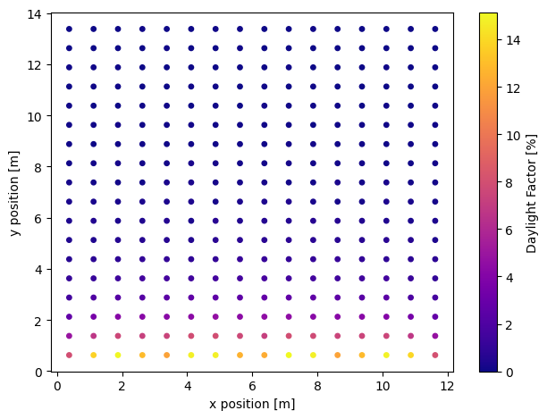

# How to calculate daylight factor?

**What is daylight factor?**

Daylight factor (DF) is the ratio of the interior horizontal illuminance to the exterior unobsturcted horizontal illuminance under overcast sky conditions. The higher the daylight factor, the more daylight is available in the room. A minimum daylight factor of 2% is usually recommended for critical visual task zones. 

## Workflow

1. Build a Radiance model
2. Generate a CIE overcast sky
3. Use raytracing to get the interior horizontal illuminance
4. Compute the daylight factor

## 0. Import the required classes and functions

```python
import datatime
import frads as fr
import pyradiance as pr
import numpy as np
```

## 1. Build a Radiance model 

If you already have a Radiance model setup, please have a octree file storing the scene files and continue on to the next step. If not, follow below to set up a sample Radiance model. See [How to setup a simple rtrace workflow?](guide_rad1.md) for more details.

Use `gen room` (a command line function) to generate a simple Radiance model. The example 'aroom' is a open-office sized side-lit room with four same-sized windows. The room will be 12 meters wide, 14 meters deep, a floor to floor height of 4 meters, and a ceiling height of 3 meters. Each window is 2.5 meters in width and 1.8 meters in height and has a sill height of 1 meter. Windows are 0.4 meters apart from each other. Finally, the facade has a thickness of 0.1 meters. 

```python 
! gen room 12 14 4 3 \
	-w 0.4 1 2.5 1.8 \
	-w 3.3 1 2.5 1.8 \
	-w 6.2 1 2.5 1.8 \
	-w 9.1 1 2.5 1.8 \
	-t 0.1 -n aroom # (1)
```

1. `gen room` is a command line function. To run shell commands from inside a IPython syntax (e.g. Jupyter Notebook), start the code with an exclamation mark (!).

Call `pyradiance.oconv` to generate a `octree` file storing the material and geometry files generated from the `gen room` command in the 'Objects' directory 

```python
fpaths = ["Objects/materials_aroom.mat",
          "Objects/ceiling_aroom.rad",
          "Objects/wall_aroom.rad",
          "Objects/floor_aroom.rad",
          "Objects/window_00_aroom.rad",
          "Objects/window_01_aroom.rad",
          "Objects/window_02_aroom.rad",
          "Objects/window_03_aroom.rad",
]
```

```python
room_octree = "aroom.oct"
with open(room_octree, 'wb') as f:
    f.write(pr.oconv(*fpaths))
```

## 2. Generate a CIE overcast sky

Use `pyradiance.gensky` to generate a CIE overcast sky. The function returns a brightness function (skyfunc) to vary the brightness of the glow material. We will assume the overcast sky has a diffuse horizontal illuminance of 10,000 lux (horizontal diffuse irradiance of 55.866 w/m2).

```python
dif_hor_illum = 10000
dif_hor_ird = dif_hor_illum / 179
```
```python
sky_func = pr.gensky(
    dt=datetime.datetime(2024, 12, 21, 12, 0),
    cloudy=True,
    horizontal_brightness=dif_hor_ird, # (1)
    )

print(sky_func)
```

1. zenith brightness is computed from the horizontal diffuse irradiance (in watts/meter2)

> ```
> void brightfunc skyfunc
> 2 skybr skybright.cal
> 0
> 3 2 2.286e+01 3.557e+00
> ```


```python
sky_glow = "skyfunc glow sky_glow 0 0 4 1 1 1 0".encode()

sky = "sky_glow source sky 0 0 4 0 0 1 180".encode()

ground = "sky_glow source ground 0 0 4 0 0 -1 180".encode()
```

```python
sky_scene = sky_func + b'\n' + sky_glow + b'\n' + sky + b'\n' + ground
```

```python title="add sky scene to octree"
room_sky_octree = f"aroom_37_122_1221_1200.oct"
with open(room_sky_octree, "wb") as f:
    f.write(pr.oconv(stdin=sky_descr, octree=room_octree))
```


## 3. Use raytracing to get the interior horizontal illuminance

Generate a grid of horizontal workplane sensors for interior horizontal illuminance computation. See [How to setup a simple rtrace workflow?](guide_rad1.md) for more details.

```python title="generate grid sensors based on the floor polygon"
floor_primitives = fr.unpack_primitives("Objects/floor_aroom.rad")
floor_polygon = fr.parse_polygon(floor_primitives[0])
grid = fr.gen_grid(floor_polygon, 1, 0.75)
```

Use `pyrandiance.rtrace` to compute ray tracing from the sensors. The function returns the irradiance results of all sensors in bytes.

```python title="rtrace to get irradiance"
option = ["-I+", "-ab", "5", "-ad", "512", "-aa", "0", "-lw", "0.001"]
rays = "\n".join([" ".join(map(str, row)) for row in grid])
ird_results = pr.rtrace(
    rays.encode(), room_sky_octree, params=option, header=False
)
print(ird_results)
```
The sensor data are separeted by '\n'. 

Each sensor data has rgb channels irradiance separated by '\t'

> ```'4.386912e+00\t4.386912e+00\t4.386912e+00\t\n2.373928e+00\t2.373928e+00\t2.373928e+00\t ... 0.000000e+00\t0.000000e+00\t0.000000e+00\t\n' ```
 
```python title="reformat the irradiance result"
rows = ird_results.decode().strip().split("\n")
data = [
    [float(element) for element in row.split("\t") if element != ""]
    for row in rows
]
ird_array = np.array(data)
```

Apply coefficients to convert irradiance into illuminance

```python title="convert irradiance to illuminance"

illum = ird_array[:, 0] * 47.4 + ird_array[:, 1] * 119.9 + ird_array[:, 2] * 11.6 # (1)
```

1. red: 47.4, blue: 119.9, green: 11.6


## 4. Compute the daylight factor


```python title="daylight factor = interior illuminance / exterior illuminance * 100"
df = illum / dif_hor_illum * 100
```

### data visualization

```python title="import visualization packages"
import matplotlib.pyplot as plt
```

```python 
fig, ax = plt.subplots()
x = [data[0] for data in grid]
y = [data[1] for data in grid]
_plot = ax.scatter(
    x,
    y,
    c=df,
    cmap="plasma",
    s=15,
    vmin=0,
    vmax=max(df),
    rasterized=True,
)
ax.set(
    xlabel="x position [m]",
    ylabel="y position [m]",
)

fig.colorbar(_plot, ax=ax, label="Daylight Factor [%]")
fig.tight_layout()
```

