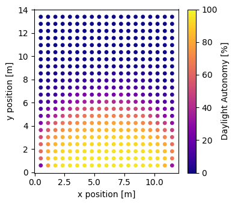

# How to simulate spatial daylight autonomy using three-phase method?

This guide will show you how to calculate spatial daylight autonomy (sDA) using the Three-Phase method in Radiance. This guide shows how to automatically generate a Radiance model and three-phase method workflow from a EnergyPlus model. See [How to setup a workflow configuration?](guide_rad2.md) and [How to calculate workplane illuminance and eDGPs using three-phase method?](guide_rad3.md) for more information on how to setup a workflow configuration and calculate workplane illuminance without an EnergyPlus model.

**What is spatial daylight autonomy?**

Spatial daylight autonomy (sDA) is the percentage of the area that meets a minimum illuminance threshold for a specified fraction of the annual occupied hours. The target illuminance threshold is usually 300 lux for 50% of the occupied period.

**Workflow**

0. Import the required classes and functions

1. Setup an EnergyPlus Model
    1. Initialize an EnergyPlus model
    2. Create glazing systems (Complex Fenestration States)
    3. Add the glazing system to the EnergyPlus model

2. Setup EnergyPlus Simulation
    1. Initialize EnergyPlus Simulation Setup
    2. Calculate workplane illuminance 
    3. Run the simulation

3. Calculate sDA

4. Visualize sDA (optional)

## 0. Import the required classes and functions

```python
import datetime
import numpy as np

import frads as fr
from pyenergyplus.dataset import weather_files
```

## 1. Setup an EnergyPlus Model
### 1.1 Initialize an EnergyPlus model

Initialize an EnergyPlus model by calling `load_energyplus_model` and passing in an EnergyPlus model in an idf or epjson file format.

```python
epmodel = fr.load_energyplus_model("RefBldgMediumOfficeNew2004_southzone.idf")
```

### 1.2 Create glazing systems (Complex Fenestration States)

```python title="Create a glazing system"
gs_ec01 = fr.create_glazing_system(
    name="ec01",
    layers=[
        "igsdb_product_7405.json",
        "CLEAR_3.DAT",
    ],
    gaps=[
        fr.Gap(
            [fr.Gas("air", 0.1), fr.Gas("argon", 0.9)], 0.0127
        )
    ],
)
```

```python title="Add the glazing system to the EnergyPlus model"
epmodel.add_glazing_system(gs_ec01)
```

## 2. Setup EnergyPlus Simulation
### 2.1 Initialize EnergyPlus Simulation Setup

Initialize EnergyPlus simulation setup by calling `EnergyPlusSetup` and passing in an EnergyPlus model and an optional weather file.

To enable Radiance for daylighting simulation, set `enable_radiance` to `True`. The default value of `enable_radiance` is `False`. This step will setup the three-phase method in Radiance. 

```python
eps = fr.EnergyPlusSetup(
    epmodel, weather_files["usa_ca_san_francisco"], enable_radiance=True
)
```

### 2.2 Calculate workplane illuminance 

Use the `calculate_wpi()` method inside a callback function to calculate the workplane illuminance at each timestamp. Save the workplane illuminance to a variable.

!!! note
    The `calculate_wpi()` method calls the `ThreePhaseMethod` class in the background. See [How to calculate workplane illuminance and eDGPs using three-phase method?](guide_rad3.md) for more information on how to use the `ThreePhaseMethod` class directly.

```python title="Create a list to store the workplane illuminance"
wpi_list = []
```

```python title="Define a callback function to calculate the workplane illuminance"
def callback_func(state):
    # check if the api is fully ready
    if not eps.api.exchange.api_data_fully_ready(state):
        return

    # get the current time
    datetime = eps.get_datetime()
    # only calculate workplane illuminance during daylight hours
    if  datetime.hour >= 8 and datetime.hour < 18:
        wpi = eps.calculate_wpi(
            zone="Perimeter_bot_ZN_1",
            cfs_name={
                "Perimeter_bot_ZN_1_Wall_South_Window": "ec01",
            }, # {window: glazing system}
        ) # an array of illuminance for all sensors in the zone
        wpi_list.append(wpi)
```

### 2.3 Run the simulation

Set the callback function to `set_callback` and run the simulation. Refer to [Application Guide for EMS](https://energyplus.net/assets/nrel_custom/pdfs/pdfs_v22.1.0/EMSApplicationGuide.pdf) for descriptions of the calling points.

```python title="Set the callback function"
eps.set_callback("callback_begin_system_timestep_before_predictor", callback)
```

```python title="Run the simulation"
eps.run(annual=True) # run annual simulation
```

## 3. Calculate sDA

Each element in `wpi_list` is a numpy array of sensors' workplane illuminance at each timestamp. Concatenate the numpy arrays in the `wpi_list` to a single numpy array. Then calculate the percentage of time when the workplane illuminance is greater than 300 lux.

```python title="Generate a numpy array of percentage of time when the sensor's workplane illuminance is greater than 300 lux"
wpi_all = np.concatenate(wpi_list, axis=1)
lx300 = np.sum(wpi_all >= 300, axis=1) / wpi_all.shape[1] * 100
```

```python title="Generate a numpy array of x and y coordinates of the sensors"
xy = np.array(
    eps.rconfigs["Perimeter_bot_ZN_1"]
    .model.sensors["Perimeter_bot_ZN_1_Floor"]
    .data
)[:, :2]
```

```python title="Concatenate the lx300 and xy numpy arrays to a single numpy array"
sda = np.concatenate([xy, lx300.reshape(-1, 1)], axis=1)
```

## 4. Visualize sDA (optional)

```python title="import matplotlib"
import matplotlib.pyplot as plt
```

```python title="Plot the sDA"
fig, ax = plt.subplots(figsize=(4, 3.5))
x, y, color = sda[:, 0], sda[:, 1], sda[:, 2]
plot = ax.scatter(
    x,
    y,
    c=color,
    cmap="plasma",
    s=15,
    vmin=0,
    vmax=100,
    rasterized=True,
)
ax.set(
    xlabel = "x position [m]",
    ylabel = "y position [m]",
)

fig.colorbar(plot, ax=ax, label="Daylight Autonomy [%]")
fig.tight_layout()
```



